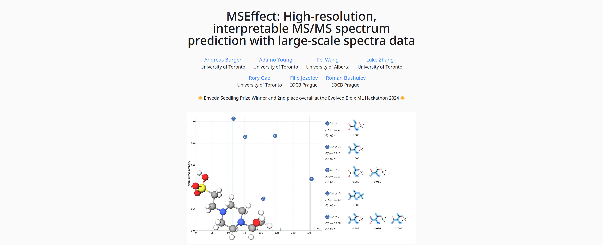

# MSEffect: High-resolution, interpretable MS/MS spectrum prediction with large-scale spectra data

🌟 Enveda Seedling Prize Winner and 2nd place overall at the Evolved Bio x ML Hackathon 2024 🌟




## Usage

0. Install Node.js
```bash
sudo apt install npm 
sudo npm install -g n
sudo n lts
hash -r
node --version
```
1. Edit the content in `/src/pages/index.mdx`, the favicon at `/public/favicon.svg` and the social link thumbnail at `/public/thumbnail.png`.
2. Run `npm install` from the root of the project to install dependencies.
3. Run `npm run dev` to see a live preview of your page while you edit it.


## Credits
This website was created from a template by [Roman Hauksson](https://github.com/RomanHauksson/academic-project-astro-template).
This template was adapted from Eliahu Horwitz's [Academic Project Page Template](https://github.com/eliahuhorwitz/Academic-project-page-template), which was adapted from Keunhong Park's [project page for _Nerfies_](https://nerfies.github.io/). It's licensed under a [Creative Commons Attribution-ShareAlike 4.0 International License](http://creativecommons.org/licenses/by-sa/4.0/).
